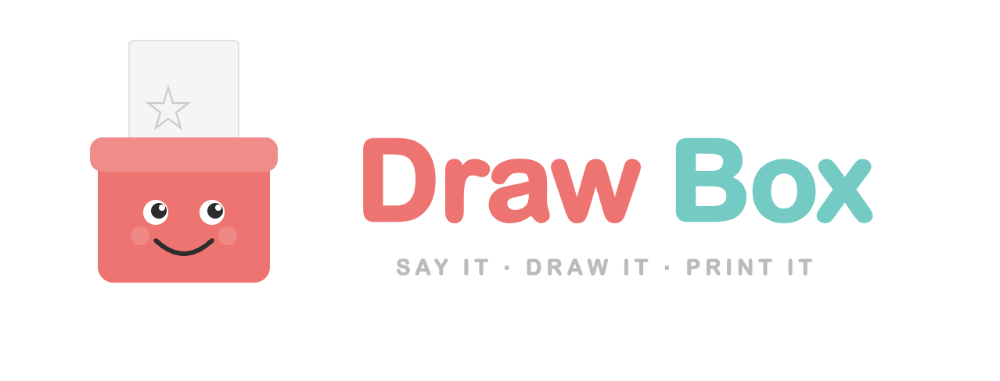

# DrawBox

**Say it. Draw it. Print it.**

Your kid presses a big red button, says what they want to draw, and a coloring page prints out in 30 seconds. No screen. No app. Just a button, a voice, and a printer.

<p align="center">
  
</p>

Built with a Raspberry Pi 5, OpenAI APIs, and a cardboard box with googly eyes.

**~3 hours to build | ~$135 in parts + printer | ~$0.06 per page**

---

## How It Works

```
Kid presses button → "I'm listening!"
    → Kid says "a happy dinosaur with flowers!"
    → Whisper transcribes speech
    → Safety filter (100-word blocklist)
    → GPT Image generates coloring page
    → Pillow converts to clean line art
    → "Here it comes!"
    → Brother laser printer prints it
    → "All done! Press the button when you want another one!"
```

The whole cycle takes ~20-30 seconds.

## Parts

| Part | What It Does | ~Price |
|------|-------------|--------|
| [PiShop Raspberry Pi 5 Budget Kit (4GB)](https://www.amazon.com/s?k=PiShop+Raspberry+Pi+5+Budget+Kit+4GB) | Pi + power supply + SD card + case | $75 |
| [Brother HL-L2405W](https://www.brother-usa.com/products/hll2405w) | B&W laser printer, USB | $100 |
| [EG STARTS 100mm Arcade Button](https://www.amazon.com/dp/B01LZMANZ7) | Big red dome button | $10 |
| [CHANGEEK USB Mic](https://www.amazon.com/dp/B0B4MJQ81C) | Gooseneck USB microphone | $10 |
| USB Sound Bar Speaker | USB-powered speaker (Pi 5 has no headphone jack) | $10 |
| [Pi 5 Active Cooler](https://www.amazon.com/s?k=Raspberry+Pi+5+Official+Active+Cooler) | Blower fan + heatsink (recommended) | $5 |
| [UGREEN USB-A to USB-B Cable](https://www.amazon.com/s?k=UGREEN+USB+A+to+USB+B+Printer+Cable) | Connects Pi to printer | $7 |
| [Female Spade Crimp Terminals](https://www.amazon.com/s?k=female+spade+crimp+terminal+4.8mm) | Connects wires to button's 4.8mm spade terminals | $8 |
| [5" Round Ventilation Grille](https://www.amazon.com/s?k=5+inch+round+ventilation+grille) | Speaker grille for the enclosure | $6 |
| Cardboard + hot glue | The enclosure | $5 |

You may also want: a [micro HDMI to HDMI adapter](https://www.amazon.com/s?k=UGREEN+Micro+HDMI+to+HDMI) for initial Pi setup with a monitor, and a [USB-C SD card reader](https://www.amazon.com/s?k=uni+SD+card+reader+USB+C) for flashing the SD card.

Tools: box cutter, metal ruler, pencil, hot glue gun, wire strippers (for spade terminals).

## Quick Start

### 1. Open the Build Guide

Open `drawbox-guide.html` in any browser. It's a single self-contained HTML file — 20 steps across 6 phases with embedded code, wiring diagrams, SVG cut templates, and troubleshooting.

### 2. Follow the 20 Steps

| Phase | Steps | What You Do |
|-------|-------|-------------|
| Getting Started | 1 | Verify all parts |
| Phase 1 — Pi Setup | 2-4 | Flash SD, SSH in, install dependencies |
| Phase 2 — Printer | 5-6 | Set up CUPS, test print |
| Phase 3 — Software | 7-10 | API key, create `drawbox.py`, manual test, auto-start service |
| Phase 4 — Hardware | 11-13 | Wire button (GPIO 17), plug in mic & speaker, integration test |
| Phase 5 — Enclosure | 14-17 | Cut panels, build box, finishing touches |
| Phase 6 — Finishing Up | 18-20 | WiFi portability, cost cap, web dashboard |

### 3. Deploy the Web Dashboard

```bash
./deploy-web.sh
```

One command copies everything to the Pi, installs Flask, creates the systemd service, and starts the dashboard at `http://drawbox.local:5000`.

### 4. Run the Health Check

```bash
./check.sh
```

Verifies: internet, API key, mic, speaker, printer, GPIO, Python deps, script correctness, services, and voice cache.

## What's In This Repo

| File | Description |
|------|-------------|
| `drawbox.py` | The main script — records speech, generates coloring pages, prints them |
| `drawbox_web.py` | Flask web dashboard — generate prints, view logs, change settings, run diagnostics |
| `drawbox-guide.html` | Complete interactive build guide — open in any browser |
| `drawbox-simulator.html` | Browser simulator — test the full flow without a Pi (needs OpenAI key) |
| `deploy-web.sh` | One-command deploy to Pi via SSH |
| `check.sh` | Health check — verifies the entire Pi setup |

## Voice Lines

DrawBox talks to kids at every step:

| When | What It Says |
|------|-------------|
| Ready | "Ready! Press the button and tell me what to draw!" |
| Listening | "I'm listening!" |
| Thinking | "Ooh, great idea!" / "That sounds awesome!" / "Cool!" (random) |
| Printing | "Here it comes!" |
| Done | "All done! Press the button when you want another one!" |
| Blocked | "Hmm, I can't draw that. How about something fun like an animal or a rainbow?" |
| Busy | "Hold on, I'm still working on your picture!" |
| Reboot | "Rebooting now! See you in a moment." (hold button 5s) |

## Cost

Each coloring page costs about **$0.06**:
- ~$0.04 image generation (GPT Image)
- ~$0.01 voice (TTS)
- ~$0.006 transcription (Whisper)

$5 gets you ~80 pages. Set a spending limit at [platform.openai.com](https://platform.openai.com) under Billing.

## Safety

This is used by young children, so safety is built in at multiple layers:

- **Word blocklist** — ~100 blocked words covering violence, sexual content, profanity, drugs, horror, and hate speech
- **Hardened prompt** — The image generation prompt explicitly instructs safe-only output
- **Friendly rejection** — "Hmm, I can't draw that. How about something fun like an animal or a rainbow?"

## Troubleshooting

| Problem | Fix |
|---------|-----|
| Printer not detected | `lsusb`, try different USB port |
| Mic not recording | `arecord -l` to list devices, check `~/.asoundrc` |
| No speaker sound | `aplay -l`, check `~/.asoundrc` card numbers |
| Button no response | Test with: `python3 -c "from gpiozero import Button; b=Button(17); print('pressed' if b.is_pressed else 'open')"` |
| Images too dark | Lower threshold from 180 to 150 in `drawbox.py` |
| Service won't start | `journalctl -u drawbox -e` — usually wrong API key |
| Dashboard not loading | `sudo systemctl status drawbox-web` |
| Need to reboot | Hold the big red button for 5 seconds |

## Pi 5 Gotchas

These are already handled in the guide, but good to know:

- **No headphone jack** — must use USB speaker
- **RPi.GPIO doesn't work** — use `gpiozero` instead
- **USB mic only supports 44100Hz** — not 16000Hz
- **Don't use `continue` in try/finally** — causes `is_busy` flag to stick

## Architecture

See [ARCHITECTURE.md](ARCHITECTURE.md) for the full technical reference — script flow, design decisions, systemd config, file layout, and known issues.

## Contributing

See [CONTRIBUTING.md](CONTRIBUTING.md). Bug fixes, build guide improvements, and photos of your build are all welcome.

## License

[MIT](LICENSE)

---

Built for my kids. Now yours can have one too.
